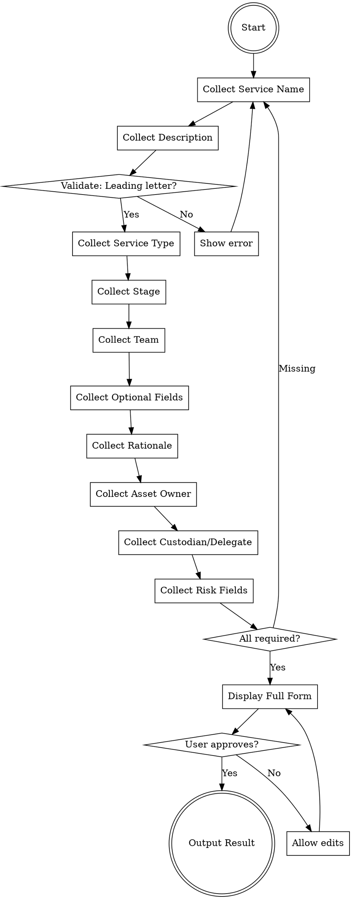

# ProdStack Request Form

## Overview

Collect structured data for the "IS-Services: Set up a new ProdStack environment" request form. This skill guides systematic collection of all required fields WITHOUT submitting any requests.

## When to Use

- User needs to file a ProdStack environment request
- Gathering data for PS7/PS5 environment provisioning
- Preparing documentation for IS Services request

**Do NOT use when:** User is requesting a service (like PostgreSQL, Kubernetes cluster, or object storage) - use the appropriate form for those.

## Core Pattern

```
For each field group:
  1. Ask the user for the value(s)
  2. Validate format/completeness
  3. Record the answer
  4. Show accumulated data
  5. Confirm before proceeding

After all fields:
  1. Display complete form data as structured output
  2. Allow edit/review loop
  3. DO NOT submit - return plan/list to user
```

## Field Collection Guide

### Section 1: Environment Details

| Field | Type | Required | Validation |
|-------|------|----------|------------|
| **Service name** | text | Yes | Alphanumeric + hyphens only, leading alphabet char, max 64 chars, descriptive name |
| **Description** | text | Yes | Max 255 chars, purpose/use of environment |
| **Service type** | select | Yes | `container_model` (Juju Kubernetes) or `machine_model` (Juju Machine) |
| **Stage** | select | Yes | `prod` (production) or `stg` (staging) |
| **Team/owner** | select | Yes | One of ~40 teams: analytics-workflows, anbox, bootstack, bootstack-devops, community, comsys, cpc, data-platform, debcrafters, desktop, devices, documentation, enterprise-engineering, field-engineering, foundations, identity, is, is-charms, is-onboarding, juju, kernel, kubeflow, kubernetes, landscape, launchpad, lxd, maas, marketing, multipass, observability, octo, openstack, partner-engineering, project-management, robotics, rocks, secops, security, server, snapd, snapstore, solqa, solutions-engineering, support, talent-science, telco, telemetry, ubuntu-archive, ubuntu-core, ubuntu-engineering, ubuntu-qa, ubuntu-release, webdesign, workplace-engineering |
| **Cloud** | select | No | `ps5` (UK) or `ps7` (EU) |
| **Compute Architecture** | select | No | `amd64`, `arm64`, `ppc64el`, `riscv64`, `s390x` (default: amd64) |
| **Juju version series** | select | Yes | `3.6` or `4.0` (default: 3.6) |
| **Rationale** | textarea | Yes | Detailed explanation of need |

### Section 2: CIA Risk Assessment

| Field | Type | Required | Options |
|-------|------|----------|---------|
| **Asset Owner** | select | Yes | Individual (@canonical.com user) - also becomes mandatory approver |
| **Asset Custodian** | select | No | Team handling asset (same list as Team/owner) |
| **Asset Risk Owner** | select | Yes | Individual responsible for asset risk - also becomes mandatory approver |
| **Asset Delegate** | select | No | Individual who can act on behalf of owner |
| **Stage** | select | Yes | `production` or `staging` |
| **Data Confidentiality Level** | select | Yes | `public`, `internal`, `confidential`, `restricted` |
| **Sensitive/Confidential Data?** | checkbox | No | Yes/No - stores/handles sensitive data |
| **Data Regulation** | multi-checkbox | No | Employee, Business Partner, Customer or User, Candidate, Financial Information, PII - IP Address, SPII - Personal Health Information, SPII - Banking Information, SPII - Other |
| **Data Strategic** | select | Yes | `minimal` (Strategic meeting noted without change impact), `noticeable` (Delay or modify some strategic decisions), `severe` (Delay or modify most strategic decisions), `blocker` (Significantly impede decision-making process) |
| **Integrity Loss - Internal Impact** | select | Yes | `minimal` (No operational impact), `noticeable` (Likely affect operations at some level), `severe` (Significant operational and financial impact), `blocker` (Stop business operations to repair) |
| **Integrity Loss - External Impact** | select | Yes | Same options as internal impact |
| **SLO - Downtime Impact** | select | Yes | `minimal` (Minimal consequences), `noticeable` (Inconvenience felt), `severe` (Critical to business function), `blocker` (Immediate urgent crisis) |
| **SLO - RTO** | select | Yes | Less than 1 hour (3600), 1-6 hours (21600), 6-12 hours (43200), 12-24 hours (86400), 1-7 days (604800), 1 week-1 month (2678400), One month or more (8035200) |

## Implementation Steps

1. **Initialize structured data:** Create empty data structure for all fields
2. **Collect Section 1:** Request each field value sequentially, include description/helptext
3. **Collect Section 2:** Walk through CIA Risk Assessment fields
4. **Validation Pass:** Ensure all required fields populated
5. **Review:** Present complete data in structured format (JSON or table)
6. **Edit Loop:** Allow user to correct/change any values
7. **Final Output:** Return structured plan to user

## Example Output Format

```yaml
Request Type: IS-Services: Set up a new ProdStack environment

Environment Details:
  Service Name: my-service-name
  Description: Mailman3 deployment for lists.canonical.com
  Service Type: container_model
  Stage: production
  Team/Owner: bootstack
  Cloud: ps7
  Compute Architecture: amd64
  Juju Version Series: 3.6
  Rationale: |
    This environment is needed for hosting mailman3
    to manage mailing lists for the BootStack team.

Risk Assessment:
  Asset Owner: johndoe
  Asset Custodian: bootstack
  Asset Risk Owner: managername
  Asset Delegate: (none)
  Stage: production
  Data Confidentiality Level: internal
  Sensitive Data: false
  Data Regulation: []
  Data Strategic: minimal
  Integrity Loss - Internal: noticeable
  Integrity Loss - External: minimal
  SLO - Downtime Impact: noticeable
  SLO - RTO: 21600
```

## Mandatory Approvers

The form will automatically select:
- **Requester's manager** (from LDAP)
- **IS sres** team (always required)
- **Asset Owner** (selected from Risk Assessment)
- **Asset Risk Owner** (selected from Risk Assessment)

User cannot override these approver selections.

## Common Mistakes

- **Using just service name in Service name:** Must be descriptive, include context (e.g., "myteam-webapp" not just "webapp")
- **Including stage in name:** Don't add "-prod" or "-staging" to the service name - stage is a separate field
- **Ambiguous team selection:** For *aaS requests, Asset Custodian is forced to "is"
- **Duplicate stage selection:** Note the form has Stage in both sections - they should match

## Collection Flowchart



## Critical Rules

1. **DO NOT SUBMIT** - Only collect and return structured data
2. **All required fields must be filled** - Form cannot proceed without them
3. **Service name validation** - Must start with letter, alphanumeric/hyphens only
4. **Team selection matters** - Custodian forced to "is" for *aaS
5. **Approvers are automatic** - Cannot control manager/sres approvals
